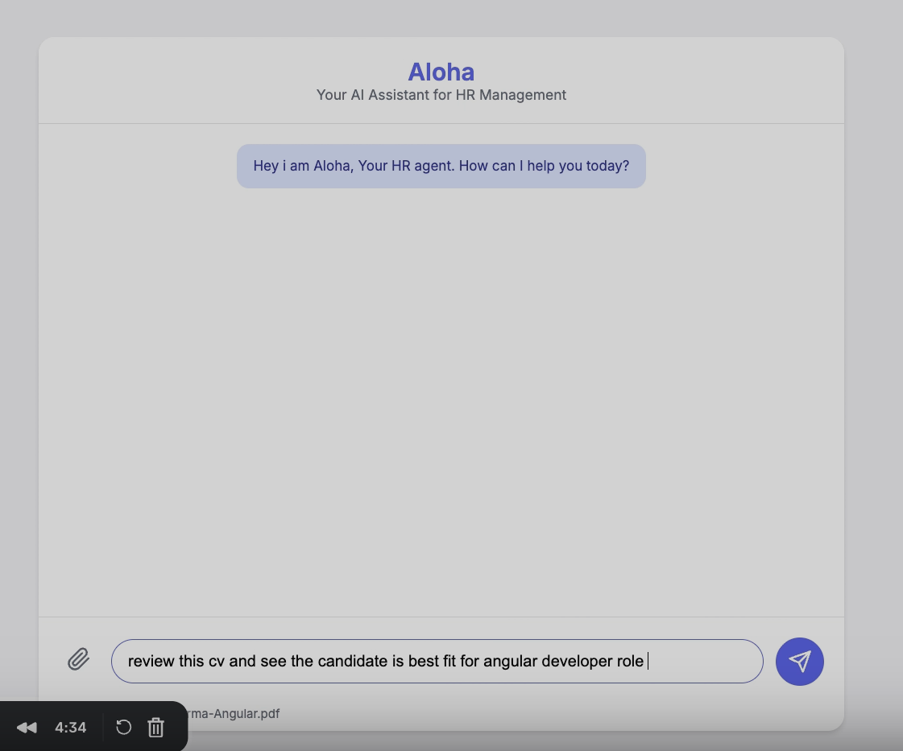

# HR Agent - AI-Powered HR Management System

An intelligent HR management system that automates candidate screening, interview scheduling, and calendar management using AI and Google Calendar integration. Now features a web-based Chat UI for seamless interaction.

## 🎥 Project Preview
[](https://www.loom.com/share/db9e2287812d46c6add99a8ca24cf17f)

## Features

### 💬 Chat Interface (New!)
- **Web-Based UI**: Clean, responsive chat interface to interact with the HR Agent.
- **File Upload**: Upload resumes directly from the chat window.
- **Interactive Conversations**: The agent can perform multi-step actions (e.g., read resume -> screen candidate -> respond) in a single conversation flow.

### 🎯 Candidate Screening
- **AI-Powered Resume Analysis**: Automatically extracts and analyzes skills from resumes (PDF, PNG, JPG, JPEG)
- **Fuzzy Matching**: Uses advanced fuzzy matching to identify similar skills (e.g., "Angular" vs "AngularJS")
- **Role-Based Assessment**: Evaluates candidates against predefined role requirements
- **Comprehensive Scoring**: Provides detailed match percentage and skill breakdown

### 📅 Interview Scheduling
- **Google Calendar Integration**: Seamlessly schedule interviews on Google Calendar
- **Automatic Meet Links**: Generates Google Meet links for virtual interviews
- **Email Notifications**: Sends automatic invitations to candidates
- **Smart Reminders**: Sets up email (1 day before) and popup (30 min before) reminders

### 🕒 Availability Management
- **Free Time Detection**: Automatically finds available time slots in the current week
- **Working Hours**: Respects 9 AM - 5 PM working hours (configurable)
- **Weekend Filtering**: Skips weekends automatically
- **Gap Analysis**: Identifies free slots between scheduled meetings

## Tech Stack

- **Frontend**: HTML5, CSS3, JavaScript (Vanilla)
- **Backend**: FastAPI, Python 3.12
- **AI/ML**: Ollama (local LLM), spaCy NLP
- **OCR**: PyMuPDF, Pytesseract, PIL
- **Calendar**: Google Calendar API
- **MCP Server**: FastMCP for tool orchestration
- **Fuzzy Matching**: RapidFuzz

## Installation

### Prerequisites

- Python 3.12+
- Ollama (for AI-powered resume processing)
- Tesseract OCR
- Google Cloud Project with Calendar API enabled

### Setup

1. **Clone the repository**
   ```bash
   git clone <repository-url>
   cd HRagent
   ```

2. **Create virtual environment**
   ```bash
   python -m venv .venv
   source .venv/bin/activate  # On Windows: .venv\Scripts\activate
   ```

3. **Install dependencies**
   ```bash
   pip install -r requirements.txt
   ```

4. **Download spaCy model**
   ```bash
   python -m spacy download en_core_web_lg
   ```

5. **Install Ollama and pull model**
   ```bash
   # Install Ollama from https://ollama.ai
   ollama pull phi3:mini
   ```

6. **Install Tesseract OCR**
   - **macOS**: `brew install tesseract`
   - **Ubuntu**: `sudo apt-get install tesseract-ocr`
   - **Windows**: Download from [GitHub](https://github.com/UB-Mannheim/tesseract/wiki)

7. **Google Calendar Setup**
   - Go to [Google Cloud Console](https://console.cloud.google.com/)
   - Create a new project or select existing one
   - Enable Google Calendar API
   - Create OAuth 2.0 credentials (Desktop app)
   - Download credentials and save as `google_service.json` in project root
   - First run will open browser for OAuth authorization
   - Token will be saved in `token.json` for future use

## Configuration

### Skills Database

Edit `hrmcpserver/hrskills.json` to add or modify role requirements:

```json
{
  "role": "angular developer",
  "description": "Angular developer skills assessment",
  "skills": {
    "technical_skills": {
      "core_angular": ["Components", "Directives", "Pipes"],
      "frontend_technologies": ["HTML5", "CSS3", "TypeScript"]
    },
    "soft_skills": [
      "Problem-solving",
      "Code review",
      "Agile/Scrum"
    ]
  }
}
```

### Working Hours

Modify in `hrmcpserver/calendar_service.py`:
```python
work_start_hour = 9  # 9 AM
work_end_hour = 17   # 5 PM
```

## Usage

### Start the Servers

1. **Start the MCP HR Server:**
   ```bash
   python ./hrmcpserver/hrserver.py --host 0.0.0.0 --port 8081
   # Runs on http://0.0.0.0:8081
   ```

2. **Start the Main Application:**
   ```bash
   python main.py
   # Runs on http://localhost:8000
   ```

3. **Access the Chat Interface:**
   Open your browser and navigate to `http://localhost:8000`.

### API Endpoints

#### Chat Endpoint
```bash
POST /chat
Content-Type: multipart/form-data

Parameters:
- message: User message string
```

#### Upload File
```bash
POST /upload
Content-Type: multipart/form-data

Parameters:
- file: File to upload
- role: User role (default: "user")
```

### MCP Tools

#### 1. Candidate Screening
```json
{
  "method": "tools/call",
  "params": {
    "name": "candidate_screening",
    "arguments": {
      "resume": "Resume text content...",
      "role": "angular developer"
    }
  }
}
```

#### 2. Get Interviewer Free Time
```json
{
  "method": "tools/call",
  "params": {
    "name": "get_interviewer_free_time",
    "arguments": {
      "interviewer": "interviewer@example.com"
    }
  }
}
```

**Response:**
```json
{
  "interviewer": "interviewer@example.com",
  "week_start": "2025-11-24",
  "week_end": "2025-11-30",
  "available_slots": [
    {
      "start": "2025-11-27T09:00:00+00:00",
      "end": "2025-11-27T10:30:00+00:00",
      "duration_minutes": 90,
      "day": "Wednesday, 2025-11-27"
    }
  ],
  "total_slots": 5,
  "working_hours": "9:00 - 17:00"
}
```

#### 3. Schedule Interview
```json
{
  "method": "tools/call",
  "params": {
    "name": "schedule_interview",
    "arguments": {
      "to_email": "candidate@example.com",
      "start_time": "2025-11-27T10:00:00+04:00",
      "end_time": "2025-11-27T11:00:00+04:00",
      "candidate_name": "John Doe",
      "role": "Angular Developer"
    }
  }
}
```

**Response:**
```json
{
  "success": true,
  "event_id": "abc123xyz",
  "event_link": "https://calendar.google.com/event?eid=...",
  "meet_link": "https://meet.google.com/xyz-abcd-efg",
  "summary": "Interview: John Doe - Angular Developer",
  "message": "Interview scheduled successfully"
}
```

## Project Structure

```
HRagent/
├── hrmcpserver/
│   ├── __init__.py
│   ├── hrserver.py           # MCP server with HR tools
│   ├── calendar_service.py   # Google Calendar integration
│   ├── prompts.py            # LLM prompts
│   └── hrskills.json         # Role requirements database
├── main.py                   # FastAPI main application
├── ollama_extractor.py       # LLM-based data extraction
├── google_service.json       # OAuth credentials (not in repo)
├── token.json               # OAuth token (not in repo)
├── uploads/                 # Uploaded resumes
└── README.md
```

## Environment Variables

Create a `.env` file (optional):
```env
OLLAMA_BASE_URL=http://localhost:11434
OLLAMA_MODEL=phi3:mini
```

## Troubleshooting

### Google Calendar Authentication Issues

1. **Delete token.json** if you changed OAuth scopes
2. **Re-run authentication** - browser will open for OAuth flow
3. **Check credentials** - ensure `google_service.json` is valid OAuth 2.0 Desktop credentials

### Resume Processing Issues

1. **Check Ollama** is running: `ollama list`
2. **Verify Tesseract** installation: `tesseract --version`
3. **Check file format** - supports PDF, PNG, JPG, JPEG

### Import Errors

1. **Activate virtual environment**: `source .venv/bin/activate`
2. **Install dependencies**: `pip install -r requirements.txt`
3. **Download spaCy model**: `python -m spacy download en_core_web_lg`

## Contributing

1. Fork the repository
2. Create a feature branch
3. Make your changes
4. Submit a pull request

## License

[Add your license here]

## Contact

[Add your contact information]
